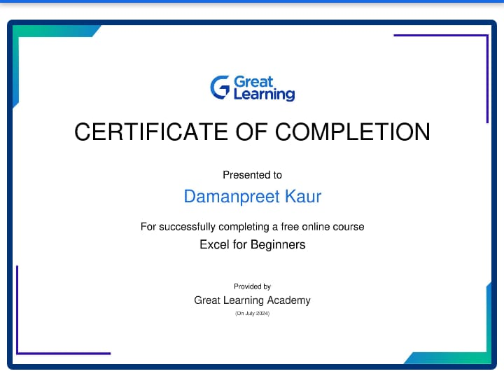

# Daman403.io                     

# About me

I am Damanpreet kaur.I passout my +2 from meritorious school ludhiana. I am persuing BTECH in IT at GNDEC college ludhiana.

# My 12th Marks

|subjects| obtained Mark|
|---------|-------------|
|maths| 94|
| chemistry| 93|
|Physics| 86|
|English| 94|
| punjabi| 98|

# My Excel Certificate 

# About Excel
Excel is powerful spreadsheet application developed by Microsoft.it's  widely used for organizing, analyzing and visualizing data through grids of cells arranged in rows and columns.Excel allows users to perform calculations,create charts, manage data,and automate tasks using formulas and functions.

# uses of Microsoft Excel

# spreadsheet basics
Excel organizes data into grids of cells where each cell can contain text, numbers, or formulas.
